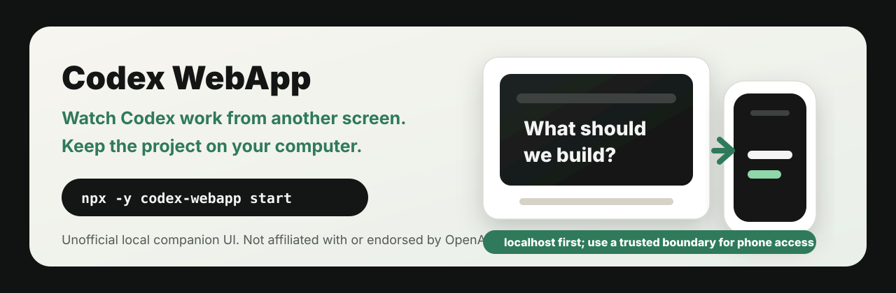

# Codex WebApp

[](https://github.com/penso-os/codex-webapp/actions/workflows/ci.yml)
[](https://www.npmjs.com/package/codex-webapp)
[](./LICENSE.md)

[English](./README.md) / 日本語 / [한국어](./docs/i18n/README.ko.md) / [简体中文](./docs/i18n/README.zh-CN.md)

**Codex の作業を、スマホで見守れる。プロジェクトはあなたのPCに置いたまま。**



Codex WebApp は、あなたの Mac に入っている Codex App をローカルのブラウザ画面として開くための companion package です。Codex に作業を任せている間、別の画面から様子を見たい。そのときもプロジェクト、secret、作業中のファイルは、作業しているPCに置いたままにしたい。そういう場面のための小さな道具です。Codex App と Codex CLI は別途インストール済みである必要があります。

この project は非公式であり、OpenAI と提携・承認・推薦されたものではありません。冒頭の local-first な説明は設計上の境界であり、絶対的な安全性の保証ではありません。安全確認、起動前チェック、smoke 証跡を添えて、ローカルで使うことを前提にしています。

launch 用の social preview と capture storyboard は [Launch Assets](./docs/launch-assets.md) にあります。公開投稿文、setup showcase、support triage のメモは [Launch Packet](./docs/launch-packet.md) にあります。

## Codex App から始める

Codex App に次を貼ってください。

```text
Codex WebApp をこのPCで起動してください。

これは Codex App ユーザー向けの非公式ローカル companion UI です。
token、cookie、private repository の中身、顧客データ、内部URL、`.env`、SECRET、KEY、TOKEN を含む内容は表示しないでください。

次の順番で進めてください。

1. `node -v`、`npm -v`、`npx -v` を確認してください。
2. `npx -y codex-webapp@latest doctor` を実行してください。
3. doctor が失敗した場合は、start に進まず原因と直し方を説明してください。
4. `npx -y codex-webapp@latest start --dry-run` を実行してください。
5. 問題なければ `npx -y codex-webapp@latest start` を実行してください。
6. 起動できたら `http://127.0.0.1:8214/` をブラウザで開くように案内してください。
7. `Ctrl+C` を押すか terminal window を閉じるとWeb画面は止まること、PC再起動後はもう一度 start が必要なことも説明してください。

スマホや外出先PCから使う場合は、raw UI server を public IP へ直接公開せず、Tailscale、Cloudflare Access、WireGuard、SSH tunneling、または同等の信頼できるアクセス境界を使ってください。
```

実際にはおおむね次を実行します。

```bash
npx -y codex-webapp@latest doctor
npx -y codex-webapp@latest start --dry-run
npx -y codex-webapp@latest start
```

## ターミナルから始める

```bash
npx -y codex-webapp doctor
npx -y codex-webapp start --dry-run
npx -y codex-webapp start
```

起動したら開きます。

```text
http://127.0.0.1:8214/
```

表示確認:

```bash
npx -y codex-webapp smoke --url http://127.0.0.1:8214/
```

screenshot 証跡:

```bash
npx -y codex-webapp smoke \
  --browser \
  --url http://127.0.0.1:8214/ \
  --screenshot artifacts/codex-webapp.png
```

## 実行すると何が起きるか

`codex-webapp start` は、このPC上でローカル adapter を起動します。ブラウザ画面は、その command が動いている間だけ使えます。

大まかな流れ:

1. ローカルの Codex tools が使えるか確認します。
2. この Mac にインストール済みの Codex App からブラウザUIを準備します。
3. デフォルトでは `http://127.0.0.1:8214/` でローカル配信します。
4. ブラウザから同じPC上の Codex app server と通信できるようにします。
5. `Ctrl+C`、terminal window の終了、接続が切れるほどの sleep、PC再起動で止まります。


この package は hosted account を作りません。workspace の cloud copy も作りません。スマホから見られる状態を単独で作るものでもありません。スマホから使う場合は、先に Tailscale や Cloudflare Access などの信頼できるアクセス境界を置いてください。

## この package に含まれないもの

この package は adapter であり、Codex App 本体ではありません。次のものは含みません。

- Codex / OpenAI binaries
- `app.asar`
- 抽出済み `webview/`
- token、cookie、signed URL、private key
- private session database
- private repository contents、prompt、customer data、その他の user data
- telemetry、analytics、browser extension、project-operated phone-home path

## Network model

Codex WebApp はデフォルトで `127.0.0.1` に bind します。つまり、同じPCからだけ開けます。非 loopback host で起動するには `--allow-non-loopback` が必要です。

起動中の UI に到達できる人は、その host 上の Codex を操作できる可能性があります。raw UI server を public IP に直接公開しないでください。スマホや別PCから使う場合は、Tailscale、Cloudflare Access、WireGuard、SSH tunneling、または同等の信頼できるアクセス境界を使ってください。

これは bounded local-first model であり、絶対的な安全性を保証するものではありません。

## Commands

| Command | 目的 |
| --- | --- |
| `doctor` | Codex CLI、version、local command の利用可否を確認します。 |
| `start --dry-run` | 実際には起動せず、予定URLを表示します。 |
| `start` | インストール済み Codex App renderer を準備して配信します。 |
| `start --yes` | 対話確認なしで起動します。 |
| `smoke` | UI URLが応答し、期待する文字列を含むか確認します。 |
| `smoke --browser --screenshot ...` | browserで開いて証跡を保存します。 |

## 必要条件

| 項目 | version または補足 |
| --- | --- |
| Codex CLI | `0.130.0` 以上。 |
| Codex App | macOS app として `/Applications/Codex.app` にインストール済み。 |
| Node.js | `20.11` 以上。 |
| network binding | デフォルトは `127.0.0.1`。 |
| package | npm の `codex-webapp`。 |

Codex が古い場合:

```bash
npm install -g @openai/codex@latest
codex --version
codex remote-control --help
```

Codex App が標準位置に無い場合は、先にインストールするか、`CODEX_APP_PATH` でローカルの `Codex.app` を指定するか、`CODEX_WEBAPP_CODEX_ASAR` でローカルの `app.asar` を指定してください。

## 技術的な境界

Codex WebApp は、インストール済み Codex App の `/Applications/Codex.app/Contents/Resources/app.asar` から `webview/` だけを `~/.cache/codex-webapp/` へ抽出し、その renderer を `127.0.0.1` で配信し、browser call をローカルの Codex app server へ橋渡しします。

Codex App の renderer file は、実行時にあなたのPC上で準備されます。この npm package には含まれず、この project が upload するものでもありません。adapter boundary の開発者向け概要は [Architecture](./docs/architecture.md) を参照してください。

## Release Evidence

release handoff 前に clean release gate を実行し、redact 済みの証跡を添付してください。

```bash
npm ci
npm test
npm run check:public-boundary
npm run verify:clean-release
npm pack --dry-run
```

Codex App が入った Mac では、local browser evidence として次を含めることもできます。

```bash
npx -y codex-webapp start
npx -y codex-webapp smoke --browser --url http://127.0.0.1:8214/
```

screenshot を共有する前に必ず確認してください。token、cookie、prompt、private repository contents、customer data、internal URL、その他の sensitive material は添付しないでください。詳細は [Clean Release Verification](./docs/clean-release-verification.md) を参照してください。

## Stop / uninstall / cache cleanup

| やりたいこと | command または操作 |
| --- | --- |
| 起動中の画面を止める | `codex-webapp start` を実行している terminal で `Ctrl+C` を押します。 |
| もう一度起動する | `npx -y codex-webapp start` を実行します。 |
| `npx` が使った npm cache を整理する | 通常の npm cache policy に従い、たとえば `npm cache verify` または `npm cache clean --force` を使います。 |
| Codex WebApp のローカル renderer cache を消す | `~/.cache/codex-webapp/` を削除します。 |
| global install した場合に削除する | `npm uninstall -g codex-webapp` を実行します。 |

`~/.cache/codex-webapp/` は削除しても大丈夫です。次に `start` したときに再作成されます。

## Known limitations

- macOS Codex App が前提です。
- local process が動いている間だけ使えます。
- `127.0.0.1` は同じPCだけです。スマホから使うには信頼できる network boundary が必要です。
- sleep、restart、VPN変更、tunnel変更で browser session が切れることがあります。
- hosted identity、account management、remote access infrastructure は提供しません。
- 非公式 project なので、Codex App internals の変更に合わせた update が必要になることがあります。

## Support

issue には OS、shell、Node version、Codex version、実行した command、redact 済みの `doctor` / `start` / `smoke` output を入れてください。token、cookie、private repository contents、customer data、internal URL は public issue に貼らないでください。起動できた setup を共有する場合は、"Show your setup" issue template を使い、[Launch Packet](./docs/launch-packet.md) の redaction guidance に従ってください。

[SECURITY.md](./SECURITY.md)、[SUPPORT.md](./SUPPORT.md)、Codex App user flow の [Codex App Install UX Guide](./docs/codex-app-install.md) も参照してください。

## License

[Apache-2.0](./LICENSE.md)
