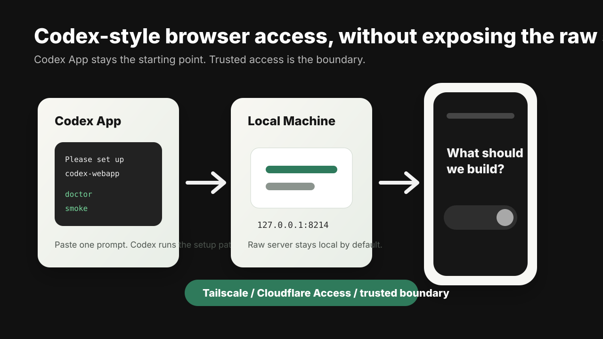

> **Unofficial community project.** This project is not affiliated with,
> sponsored by, endorsed by, or associated with OpenAI, the official Codex team,
> or the official Codex App.

# Codex WebApp

[](https://github.com/penso-os/codex-webapp/actions/workflows/ci.yml)
[](https://www.npmjs.com/package/codex-webapp)
[](https://www.npmjs.com/package/codex-webapp)
[](./LICENSE.md)

A respectful, community-maintained web app surface for Codex App users.

It gives you a pasteable Codex App prompt, a friendly `doctor`, a safe local
launcher, and smoke tests that prove a real Codex-style browser surface is
reachable from a machine you control.


> Not affiliated with or endorsed by OpenAI.
>
> Keep the raw UI server on `localhost` unless you have Tailscale, Cloudflare
> Access, or an equivalent trusted access boundary. Do not put the raw server on
> a public IP.

Quick check:

```bash
npx -y codex-webapp@beta doctor
```

## Languages

- English: this README
- Japanese: [README.ja.md](./README.ja.md)
- Korean: [docs/i18n/README.ko.md](./docs/i18n/README.ko.md)
- Simplified Chinese: [docs/i18n/README.zh-CN.md](./docs/i18n/README.zh-CN.md)

## Who This Is For

This package is for people who opened Codex App, heard that Codex can be used
from a browser or phone, and then got stuck at "the server is running, but what
do I open?"

It is also for maintainers who want a repeatable public-beta gate:

- check the local Codex install
- start the Codex-style browser UI on a safe local port
- verify the page with HTTP or browser smoke tests
- collect evidence before sharing a beta package
- document the trusted-access boundary instead of improvising it in DMs

## Current Beta Shape

Current npm beta: `codex-webapp@0.1.0-beta.1`

This is an npm package that Codex App can run through a prompt. It is not a
native Codex App marketplace plugin, browser extension, one-click installer, or
managed hosting service.

The current beta is experimental and compatibility-first. It launches a pinned
Codex-style web runtime reference, currently `0xcaff/codex-web` at commit
`585613f5a3a355af5aefc388ca4e31b07a472cda`, and wraps it with clearer install,
safety, evidence, and support behavior. The public repository is kept focused on
the package, user documentation, safety notes, and contribution path.

## Codex App Quick Start

Paste this into Codex App:

```text
Please set up Codex WebApp on this machine.

Use this npm package:
codex-webapp@beta

Please:
1. Check my Codex version.
2. Run the package doctor.
3. Run start in dry-run mode first.
4. Start the local browser UI only on localhost.
5. Smoke-test the printed local URL.

Keep everything on localhost unless I already have Tailscale, Cloudflare Access,
or another trusted access boundary set up.

Do not print tokens, cookies, private repo contents, customer data, or internal URLs.
```

Codex should run commands like these for you:

```bash
npx -y codex-webapp@beta doctor
npx -y codex-webapp@beta start --dry-run
npx -y codex-webapp@beta start
```

If Codex App asks what `npx` means, the plain-English answer is:

> `npx` runs a published npm package temporarily, without asking you to install
> or manage a project by hand.

## Terminal Quick Start

Developers can run the same flow from a terminal:

```bash
# 1. Confirm Codex is available.
codex --version

# 2. Check whether the remote-control command exists.
codex remote-control --help

# 3. Run the friendly readiness check.
npx -y codex-webapp@beta doctor

# 4. Preview the launcher command without starting anything.
npx -y codex-webapp@beta start --dry-run

# 5. Start the local Codex-style browser UI.
npx -y codex-webapp@beta start
```

By default the browser UI is local only:

```text
http://127.0.0.1:8214/
```

## Browser Smoke Test

Once the UI server is running:

```bash
npx -y codex-webapp@beta smoke \
  --url http://127.0.0.1:8214/
```

The lightweight smoke test fetches the page and checks for the expected
Codex-style surface. To capture browser evidence:

```bash
npx -y codex-webapp@beta smoke \
  --browser \
  --url http://127.0.0.1:8214/ \
  --screenshot artifacts/codex-webapp.png
```

If Playwright is missing:

```bash
npm install -D playwright
npx playwright install chromium
```

Public evidence must use a clean or demo environment. Do not publish screenshots
that expose private repositories, private branches, account metadata, customer
data, tokens, cookies, or internal URLs.

## Safety Boundary

This package does not make an unsafe network setup safe.

Use one of these boundaries:

- `localhost` only for local use
- Tailscale for private-device access
- Cloudflare Access or an equivalent identity-aware proxy for shared access

Do not:

- expose a raw Codex UI server on a public IP
- paste tokens, cookies, customer data, or private repository contents into
  public issues
- describe this project as an official OpenAI or Codex product
- treat the current beta as a managed hosting service

## Security And Privacy

This package is open source and intended to be auditable.

The CLI wrapper does not send your prompts, repositories, tokens, cookies, or
customer data to a third-party service operated by this project. It launches a
local Codex-style browser surface and runs local readiness/smoke checks against
the URL you provide.

This package does not install a browser extension and does not write browser
tokens to `localStorage`, `chrome.storage`, or an extension profile. The
underlying Codex-style runtime and your own trusted-access layer may have their
own behavior; review and operate those components as part of your deployment
boundary.

Codex WebApp does not include telemetry, analytics, or a project-operated
phone-home path.

For public support, remove secrets and private URLs before sharing command
output or screenshots.

## Product Principles



- **Codex App first**: the primary path is a prompt a non-CLI user can paste
  into Codex App.
- **Compatibility first**: staying close to the Codex browser experience is more
  valuable than a custom UI that drifts quickly.
- **Security owned**: the public package must keep the raw server local and make
  trusted access explicit.
- **Evidence driven**: launch claims must be backed by doctor, dry-run, smoke,
  browser, and clean-sandbox evidence.
- **Contribution friendly**: the repo should be easy to inspect, test, and
  improve without needing private maintainer context.

## Repository Layout

```text
bin/codex-webapp.mjs      CLI entrypoint for doctor/start/smoke
src/commands.js           CLI command handlers
src/browserSmoke.js       HTTP and optional Playwright smoke checks
src/codexWeb.js           Codex-style web launch arguments and safety checks
src/version.js            Codex CLI version parsing and readiness checks
test/*.test.mjs           node:test coverage
docs/assets/              public-safe README visuals
docs/i18n/                localized quickstart docs
docs/codex-app-install.md Codex App prompt-driven setup guide
docs/ja-quickstart.md     Japanese quickstart guide
```

## Development

```bash
npm test
npm pack --dry-run
npm run start:dry-run
```

## Support

Open a GitHub issue with:

- your OS
- Node version
- Codex version
- the exact command you ran
- the doctor or smoke output after removing secrets and private URLs

Never paste tokens, cookies, private repository contents, customer data, or
internal URLs into a public issue. See [SECURITY.md](./SECURITY.md) and
[SUPPORT.md](./SUPPORT.md).

## Project Boundary

This repository is the public distribution layer for the browser companion:
launcher, doctor, smoke tests, documentation, safety boundary, and release
evidence.

Managed hosting, private support operations, proprietary gateways, and internal
workspace automation are outside this public package.

## Acknowledgements

The current beta uses and acknowledges the public `0xcaff/codex-web` approach
for rendering a Codex-like browser surface. This project adds distribution,
doctor, safety, documentation, and release-evidence layers around that style of
workflow while keeping the non-affiliation boundary explicit.

See [ACKNOWLEDGEMENTS.md](./ACKNOWLEDGEMENTS.md).

## License

[Apache-2.0](./LICENSE.md)
