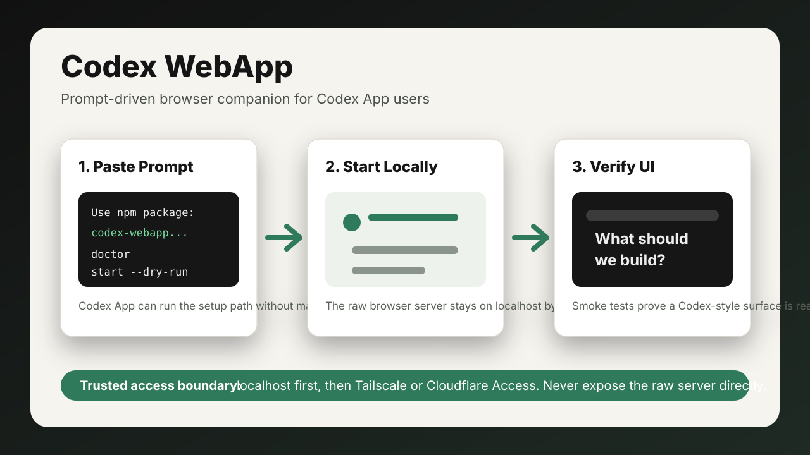

> **Unofficial community project.** This project is not affiliated with,
> endorsed by, sponsored by, or associated with OpenAI or the official Codex App.

# Codex WebApp

[English](../../README.md) / [日本語](../../README.ja.md) / [한국어](./README.ko.md) / 简体中文

这是面向 Codex App 用户的浏览器 companion。

它提供可直接粘贴到 Codex App 的提示词、友好的 `doctor` 检查、安全的本地启动器，以及用于确认真实 Codex 风格浏览器界面是否可访问的 smoke test。



> 本项目不隶属于 OpenAI，也未获得 OpenAI 的官方认可或背书。
>
> 原始 UI 服务器默认应只监听 `localhost`。如果需要从手机或另一台电脑访问，请先使用 Tailscale、Cloudflare Access，或同等的可信访问边界。不要把原始服务器直接暴露到公网 IP。

Note: The software interface is currently available mainly in English. This
Simplified Chinese documentation has been translated for setup convenience.

## Codex App 快速开始

把下面的提示词粘贴到 Codex App：

```text
Please set up Codex WebApp on this machine.

Use this npm package:
codex-webapp

Please:
1. Check my Codex version.
2. Run the package doctor.
3. Run start in dry-run mode first.
4. Start the local browser UI only on localhost.
5. Smoke-test the printed local URL.

Keep everything on localhost unless I already have Tailscale, Cloudflare Access,
or another trusted access boundary set up.

Do not print tokens, cookies, private repo contents, customer data, or internal URLs.
```

Codex 通常会为你执行类似命令：

```bash
npx -y codex-webapp doctor
npx -y codex-webapp start --dry-run
npx -y codex-webapp start
```

`npx` 的简单解释：它会临时运行一个已经发布到 npm 的包，减少手动安装和管理项目依赖的麻烦。

## 终端快速开始

```bash
codex --version
codex remote-control --help
npx -y codex-webapp doctor
npx -y codex-webapp start --dry-run
npx -y codex-webapp start
```

默认本地地址：

```text
http://127.0.0.1:8214/
```

## Smoke Test

```bash
npx -y codex-webapp smoke \
  --url http://127.0.0.1:8214/
```

公开 issue 或截图时，请不要包含 token、cookie、私有仓库、客户数据或内部 URL。

## 当前范围

这不是 Codex App native marketplace plugin、browser extension、one-click installer 或 managed hosting service。它的使用方式是：把提示词粘贴到 Codex App，让 Codex 通过 `npx` 执行 npm 包。

当前 release 为 `0.1.6`，仍处于 early 阶段，并采用 compatibility-first 方针。它目前运行一个引用 `0xcaff/codex-web` commit `585613f5a3a355af5aefc388ca4e31b07a472cda` 的 Codex 风格 browser runtime，并在其周围增加安装、安全、文档和验证证据层。

## Security And Privacy

此 CLI wrapper 不会把你的 prompt、repository、token、cookie 或 customer data 发送到由本项目运营的 third-party server。本包不会安装 browser extension，也不会把 browser token 写入 `localStorage`、`chrome.storage` 或 extension profile。

公开 issue 或截图时，请不要包含 secret、私有仓库、客户数据或内部 URL。

## Acknowledgements

当前 release 使用并感谢 public project `0xcaff/codex-web` 提供的 Codex 风格浏览器界面思路。本项目在此基础上增加分发、doctor、安全边界、文档和验证证据层。

License: [Apache-2.0](../../LICENSE.md)
